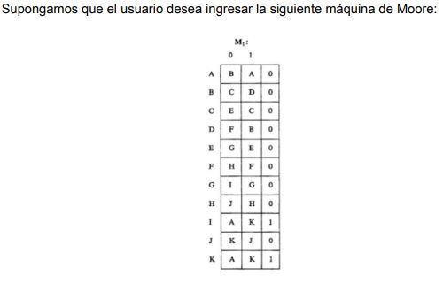
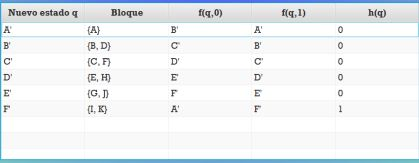
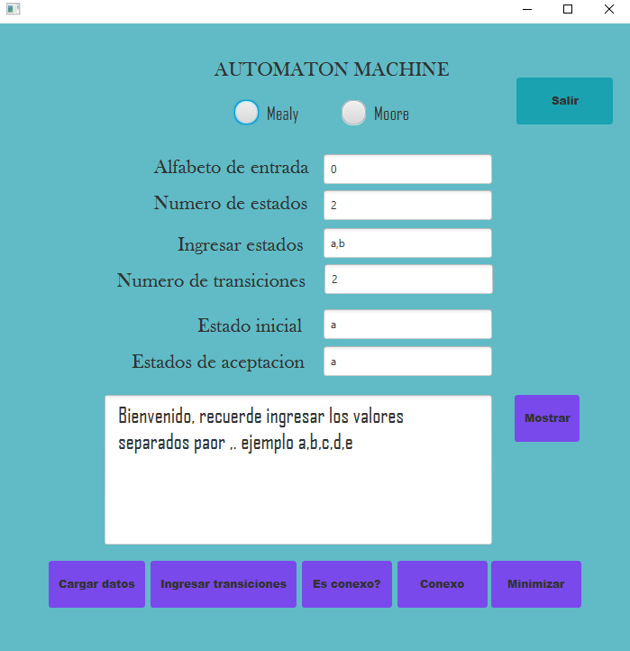
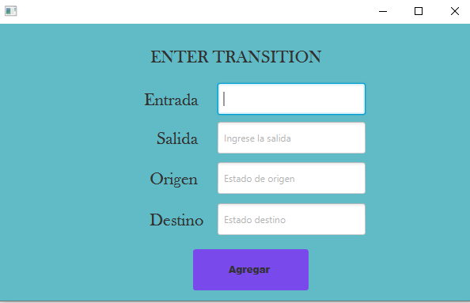

# FiniteStateAutomata
implementation of a program that, from a finite state automaton, generates its connected automaton and minimum equivalent.

## AUTÓMATAS CONEXOS
Estados accesibles y Autómatas conexos

Definición:

Sea un AFD = (E[], Q, f, q0, F),
el estado p es ACCESIBLE desde q si f’(q, x) = p. En otro caso se dice que es INACCESIBLE.
Resultado: Todo estado es accesible desde sí mismo pues f’(p, λ ) = p

Por tanto, un autómata es conexo si todos los estados son accesibles desde el estado inicial. Para convertir un autómata no conexo en conexo hay que eliminar los estados no accesibles.Es importante destacar que un autómata conexo y su no conexo equivalente, reconocen el mismo lenguaje.

## MÍNIMO EQUIVALENTE

Para minimizar una máquina de estado, se busca reducir el número de estados y transiciones necesarios para representar el comportamiento del sistema, sin perder información importante. Esto se puede hacer aplicando diferentes técnicas y algoritmos de minimización, como el algoritmo de minimización de Hopcroft, que es uno de los más utilizados.

El proceso de minimización generalmente implica los siguientes pasos:

1. Identificar los estados equivalentes: dos estados son equivalentes si producen la misma salida para todas las entradas posibles. Para identificar estados equivalentes, se puede utilizar la técnica de partición de estados.

2. Fusionar los estados equivalentes: una vez que se han identificado los estados equivalentes, se pueden fusionar en un único estado, reduciendo así el número total de estados.

3. Actualizar la función de transición: después de la fusión de estados, se debe actualizar la función de transición para reflejar los cambios en la máquina de estado.

4. Eliminar estados inalcanzables: finalmente, se deben eliminar los estados que no son alcanzables desde el estado inicial, ya que no son necesarios para representar el comportamiento del sistema.

## Maquina minimizada

## Instrucciones de uso

Para ejecutar este programa, debes tener instalado  [ECLIPSE IDE](https://eclipseide.org/) y tener instalado el paquete de [JavaFX](https://o7planning.org/10619/install-efxclipse-for-eclipse). Tambien, debes tener instalado [Java SDK 1.8](https://www.oracle.com/co/java/technologies/javase/javase8-archive-downloads.html) (no se garantiza que funcione con otra version de java).

Al ejecutar el programa de saldra esta ventana

Esta es la pagina principal del proyecto, para iniciar debes seleccionar si vas a añadir una maquina de Moore o de Maely (solo seleccionar una), el progrma carga unos valores por defecto, pero tu debes diligenciar cada uno de los campos con tus propios valores, ten en cuenta en los campos de Alfabeto de entrada, Ingresar estados  y Estados de aceptacion debes ingresar los valores separados por una coma ','. Los valores de los campos Numero de estados y de transiciones son numericos. Una vez diligenciados todos los campos, debes dar click al boton "CARGAR DATOS" para que el sistema carge los datos que ingresaste. Luega, deberas ingresar cada transicion de acuerdo con el numero de transiciones que diligenciaste en el campo de arriba. Cuando le das click al boton "INGRESAR TRANSICIONES" te mostrara esta pantalla.

Nota: sobre el numero de transiciones a ingresar, ten en cuenta que si vas a ingresar un automata con un simbolo de entrada (0) y dos estados, debes ingresar como minimo 2 transiciones para que el programa funcione, si ingresas 2 o mas simbolos de entra deberas ingresar un numero de transiciones de la forma: x = numero de simbolos de entrada, y = numero de estados, entonces numero de transiciones = y^x. Este valos es el minimo, puede tener un mayor numero de transiciones(aunque no se recomienda que ingreses un numero mayor)

Deberas diligenciar cada uno de los campos de acuerdo a los valores que ingresaste en la pantalla anterior. Cuando termines de llenar los campos, debes pulsar Click en "AGREGAR" y volveras a la pagina principal. Deberas hacer ese mismo proceso por cada transicion que desees ingresar. 

Una vez ingresaste todas las transiciones, dale click en el boton "ES CONEXO?" para saber si el automata que ingresaste es conexo o no, el resultado se mostrara en el textArea, si el resultado es "FALSE" el automata no es conexo, pero si se muestra "TRUE" el automata es conexo. Si el automata no es conexo, dale Click al boton "CONEXO" para que te muestre el automata conexo.

Si quieres ver la tabla de transicion, dale click al boton "MOSTRAR" y se mostrara la tabla de transicion en el textArea(solo se mostrara si ya agregaste todas las transiciones y probaste si el automata es conexo). Para finalizar, si quieres minimizar el automata, dale click al boton "MINIMIZAR" y se mostraran las particiones finales del automata (solo se mostrara si ya agregaste todas las transiciones). Por ultimo, para salir del programa, dale click al boton "SALIR".

## Autores

## Jesus Garces
## Juan Pablo Acevedo
